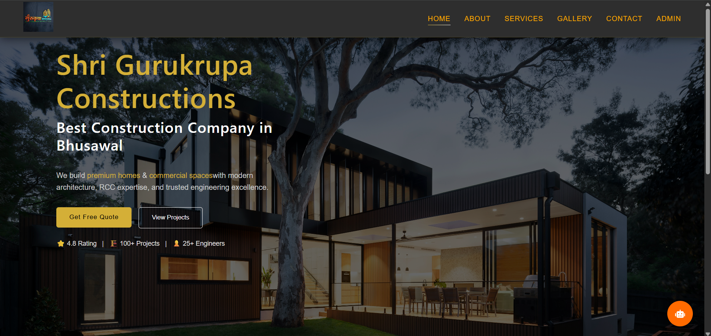
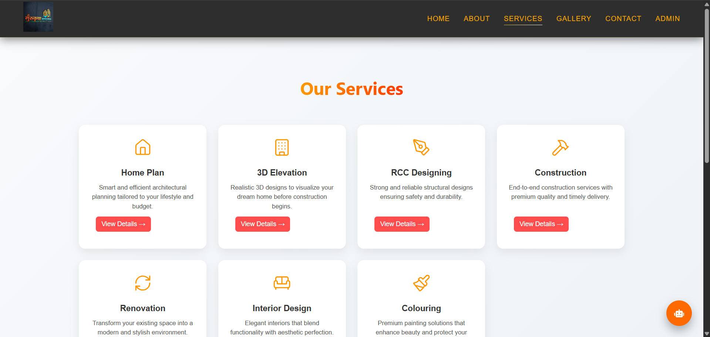
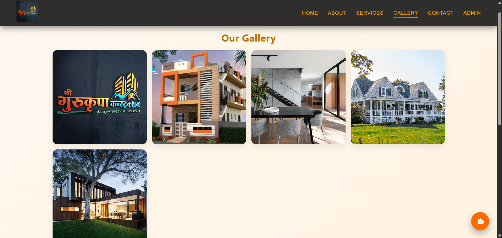
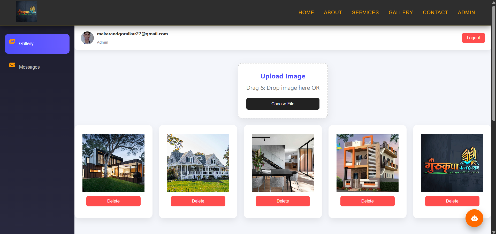
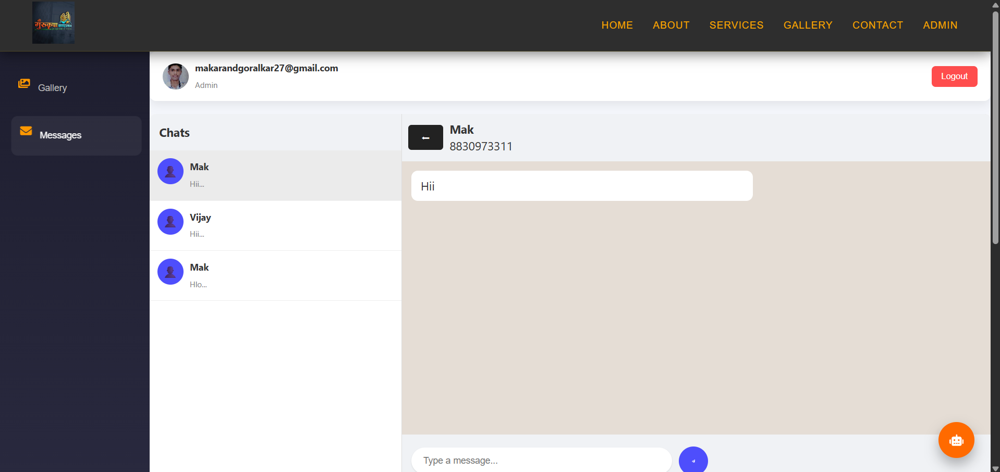

# 🏗️ Shri Gurukrupa Constructions

🚀 **Best Construction Company in Bhusawal**

A **Modern Construction Company Website with Admin Dashboard** built using **React.js + Firebase**.
We build **premium homes & commercial spaces** with modern architecture, RCC expertise, and trusted engineering excellence.

---

## 🌐 Live Application

🔗 **Website (Frontend)**
https://gurukrupa-construction.web.app/

🔗 **Admin Dashboard**
https://gurukrupa-construction.web.app/admin-login

---

## ⭐ Highlights

* ⭐ **4.8 Rating**
* 🏗️ **100+ Projects Completed**
* 👷 **25+ Engineers**
* 😊 **43+ Happy Clients**
* 📅 **9+ Years Experience**

---

## 📌 About The Project

**Shri Gurukrupa Constructions** is a professional construction platform that provides:

* 🌐 Customer-facing website
* 🔐 Admin dashboard for management
* 🖼️ Dynamic gallery system
* 💬 Customer inquiry system

We deliver **high-quality residential and commercial construction** with modern design, strong structure, and trusted execution.

---

## 📌 Features

### 🌐 Customer Website

* 🏠 Modern Home Page with CTA (Get Free Quote / View Projects)
* 🏗️ Services showcase with detailed pages
* 🖼️ Dynamic Gallery (real-time updates)
* 📞 Contact Form (stores customer messages)
* 📱 Fully Responsive Design (Mobile + Desktop)
* 🔍 SEO Optimized (robots.txt + sitemap.xml)

---

### 🔐 Admin Dashboard

* 🔑 Secure Login Authentication (Firebase Auth)
* 🖼️ Upload / Delete Gallery Images
* 💬 View Customer Messages (Chat UI)
* 👤 Profile Image Upload / Remove
* ⚡ Real-time Database Updates

---

## 🏗️ Services Offered

* 🏠 Home Planning (Smart Architecture)
* 🧱 RCC Designing (Strong & Durable Structures)
* 🏗️ Construction (End-to-End Execution)
* 🏢 Commercial Projects
* 🎨 Interior Design (Modern & Elegant)
* 🔨 Renovation (Upgrade Existing Spaces)
* 🎨 Colouring (Premium Painting Solutions)
* 🏡 3D Elevation (Realistic Designs)

---

## 🧱 Tech Stack

### Frontend

* React.js (Vite)
* React Router
* CSS (Custom Styling)
* SweetAlert2
* React Icons

### Backend / Database

* Firebase Realtime Database
* Firebase Authentication
* Firebase Hosting

---

## 🚀 Production Features

* 🔐 Secure Admin Login
* ⚡ Real-time Data Sync
* ☁️ Firebase Hosting Deployment
* 📱 Fully Responsive UI
* 📦 Optimized Build (Vite)

---

## 📁 Project Structure

```id="gurukrupa-structure"
gurukrupa/
├── public/
│   ├── images/
│   ├── robots.txt
│   └── sitemap.xml
│
├── src/
│   ├── components/
│   ├── pages/
│   ├── styles/
│   ├── firebase.js
│   └── main.jsx
│
├── package.json
└── README.md
```

---

## 🗄️ Database Design (Firebase)

### Collections:

* `users` → Admin profile data
* `gallery` → Uploaded images
* `messages` → Contact form messages

### Relationships:

* Admin manages gallery content
* Users send messages via contact form
* Messages are displayed in admin dashboard

---

## 👷 Team

### 👨‍🔧 Project Engineer

**Er. Prafulla Wankhede**
Senior Project Engineer

* 10+ years experience
* Expertise in structural execution & project planning
* Delivered multiple high-quality projects

---

## ▶️ How to Run the Project

### 🔧 Local Setup

```bash id="gurukrupa-setup"
git clone https://github.com/Makarandgoralkar/gurukrupa.git
cd gurukrupa
npm install
npm run dev
```

---

## 🚀 Deployment (Firebase)

```bash id="gurukrupa-deploy"
npm run build
firebase deploy
```

---

## 📞 Contact

📍 Bhusawal, Maharashtra
📞 +91 8999916870
✉️ [shrigurukrupac@gmail.com](mailto:shrigurukrupac@gmail.com)

---

## 🌐 Social Media

* 📸 Instagram
* 👍 Facebook

---

## 👨‍💻 Developer

**Makarand Goralkar**
Full Stack Developer

📧 [makarandgoralkar27@gmail.com](mailto:makarandgoralkar27@gmail.com)

---

## 📄 License

This project is developed for business and demonstration purposes.

© 2026 Shri Gurukrupa Constructions. All Rights Reserved.

---

## 📸 Screenshots

*(Add your screenshots in /screenshots folder)*

### 🏠 Home Page



### 🏗️ Services Page



### 🖼️ Gallery



### 📊 Admin Dashboard



### 💬 Chat System



---
